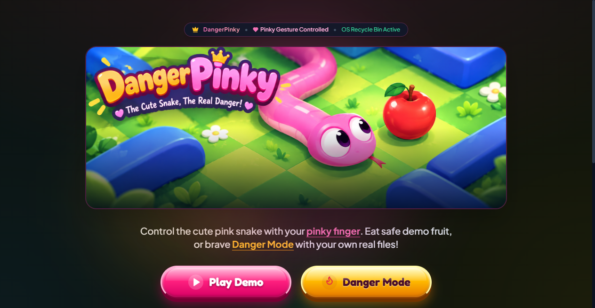
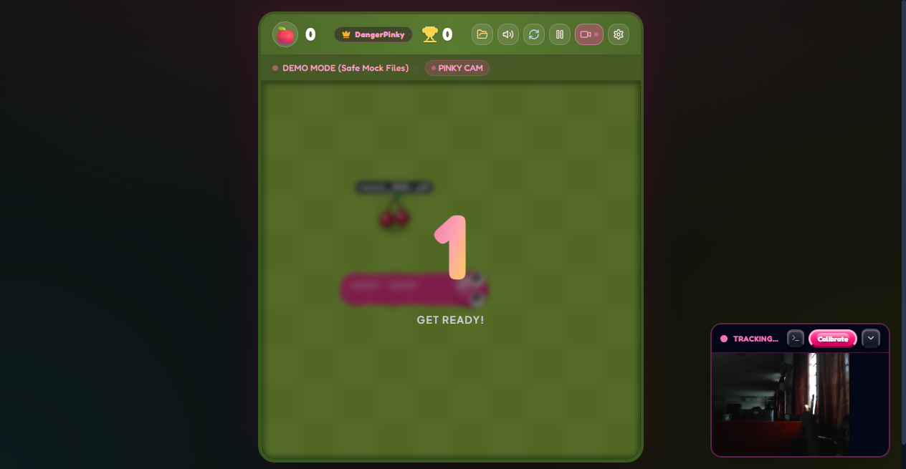
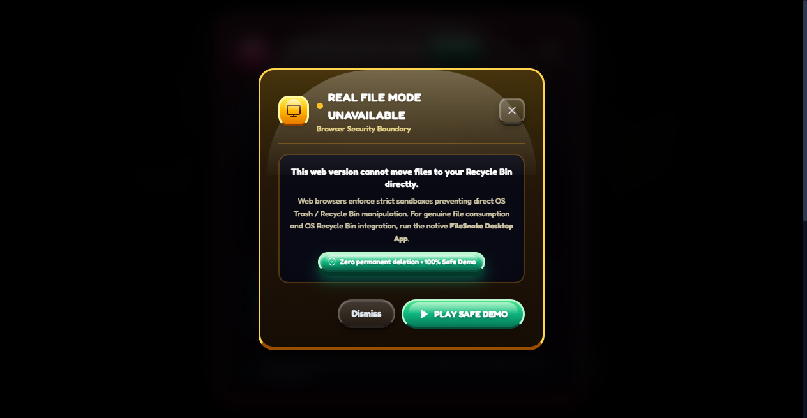
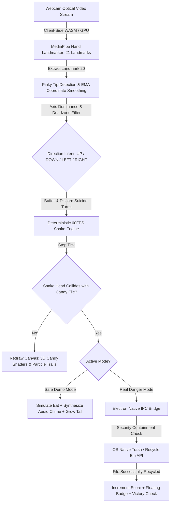

# DangerPinky 🎯

> **The cute candy snake. The ultimate useless danger. Russian Roulette for your local filesystem.**

[](https://vishnuu-kr.github.io/DangerPinky/)
[](https://drive.google.com/file/d/1aIiCRxT6f9T7WfaB7Iu2qHBtmiiLmvXs/view?usp=drive_link)
[](https://github.com/vishnuu-kr/DangerPinky)

---

## Basic Details

### Team Name: VISHNU K R

### Team Members
- Team Lead: VISHNU K R - SNM INSTITUTE OF MANAGEMENT AND TECHNOLOGY, MALIYANKARA

---

### Project Description
DangerPinky is an adrenaline-fueled, high-stakes arcade game where you steer an innocent-looking, adorable candy-pink snake using **nothing but your webcam and your little finger (pinky)**. 

Instead of mundane red apples, the snake snacks on **real files and folders discovered directly from your computer**. In **Safe Demo Mode**, enjoy peace of mind as the snake chomps on simulated dummy files. But flip the switch to **Real Danger Mode**, and the gloves come off: every single file your pinky accidentally steers the snake into is **instantly banished straight into your operating system's Recycle Bin in real time**! It is part retro arcade homage, part computer-vision technical flex, and 100% the most stressful way to organize your hard drive known to humanity.

---

### The Problem (that doesn't exist)
Your Downloads folder is a digital wasteland of 2,400 unorganized files: 47 versions of `assignment_final_v2_FINAL_really_final.pdf`, random zip archives from 2021 you never opened, blurry memes from WhatsApp, and questionable installers you forgot existed.

Traditional disk cleanup software (like Windows Disk Cleanup or CCleaner) is sterile, soulless, and completely deprived of dopamine. You select checkboxes, click "Delete", and wait in silence. Where is the thrill? Where is the existential dread? Where is the risk of accidentally destroying your college project because your hand trembled after drinking too much coffee? Humanity has spent decades making file deletion safe, forgiving, and boring. We decided it was time to bring back the fear.

---

### The Solution (that nobody asked for)
We engineered **DangerPinky** — turning routine hard drive cleanup into a competitive, sweat-inducing arcade survival game:

1. **Pinky-First Computer Vision**: We strapped Google's MediaPipe Hand Landmarker neural network to your webcam. Forget keyboards and mice — your pinky tip (Landmark 20) is your steering wheel. Flick it Up, Down, Left, or Right to change directions.
2. **Your Files Become Candy Fruits**: The game scans any local folder you dare to pick and converts your spreadsheets, code repos, and holiday photos into plump, glossy 3D candy fruits (Watermelons, Cherries, Apples, Strawberries, Grapes) floating with custom file badges.
3. **The Danger Mode Russian Roulette**: If you enable Danger Mode, every bite executes a native Electron OS-level IPC call that moves that exact file into your Recycle Bin. Have an exam in three hours? Point the snake at your semester study notes folder and pray your webcam lighting doesn't drop.
4. **Procedural Web Audio Synth**: Every file swallowed generates unique procedural audio waveforms depending on its file extension — high-pitch sparkly chimes for images, gritty 8-bit square arpeggios for code, and ominous brass thuds for heavy archive zips.

---

## Technical Details

### Technologies/Components Used

#### For Software:
- **Languages used**: TypeScript (Strict Mode), JavaScript (ESNext), HTML5, CSS3
- **Frameworks used**: React 18, Vite 5, Tailwind CSS 3
- **Libraries used**: 
  - `@mediapipe/tasks-vision` (MediaPipe Hand Landmarker WebAssembly & GPU delegate)
  - `lucide-react` (Candy Pink UI iconography)
  - `canvas-confetti` (Celebration physics for high scores & board-clear victory)
  - `clsx` & `tailwind-merge` (Dynamic reactive UI styling)
- **Tools used**: Electron 34, Node.js IPC, Esbuild, Vitest (116 automated test suites across 7 test files), Git, GitHub CLI

#### For Hardware:
- **List main components**:
  - 1x Human Hand equipped with at least one operational little finger (Pinky Finger)
  - 1x Standard RGB Webcam (Integrated laptop webcam or external USB camera)
  - 1x Computer Monitor or Display screen
- **List specifications**:
  - Webcam: 720p or 1080p resolution @ 30 FPS minimum
  - Pinky Finger: 180-degree articulation range, operating at standard human body temperature (~37°C)
  - Lighting: Room lighting sufficient for optical computer vision contrast
- **List tools required**:
  - A desk, an office chair, and an uncompromising tolerance for accidental data loss

---

### Implementation

#### For Software:

# Installation
```bash
# 1. Clone the repository
git clone https://github.com/vishnuu-kr/DangerPinky.git

# 2. Enter project folder
cd DangerPinky

# 3. Install dependencies
npm install
```

# Run
```bash
# Launch Desktop App (with full Real Danger Mode & OS Recycle Bin integration)
npm run desktop
# (or after building: npm start)

# Launch Browser Web Mode (Safe Demo Mode only)
npm run dev

# Run Automated Test Suite (116 comprehensive unit tests across engine, CV, and filesystem)
npm test

# Build Production Bundles
npm run build && npm run build:electron
```

---

### Project Documentation

#### For Software:

# Screenshots

https://drive.google.com/drive/folders/1u7BUqhHbVeiD0sxTesiC41KkblEXHwSi?usp=sharing
*DangerPinky Landing Dashboard — choose Safe Demo Mode or High-Stakes Danger Mode*


https://drive.google.com/file/d/1E13dHVe5IdU1-mxnOFmG7JbfV21UzL75/view?usp=drive_link
*Webcam Pinky Tracking in action — snake devouring local files rendered as 3D plump candy fruits*


*Candy Customization Suite — select grid sizes (10x10 standard, 12x12, 16x16), game modes, and sensitivity*


https://drive.google.com/file/d/12AMU697n9hAq0ShGtS5y6lWmXqVebLXe/view?usp=drive_link
*Game Over modal showing session statistics, files eaten/recycled, and high score fanfare*

# Diagrams

*End-to-End DangerPinky Flow: Optical Pinky Tracking → Physics Engine → Electron OS Recycle Bin.*

---

#### For Hardware:

# Schematic & Circuit
```
  [ Human Brain ]
         │ (Impulse to clean Downloads folder)
         ▼
  [ Pinky Finger Extensor Muscle ] 
         │ (Flick gesture @ 37°C)
         ▼
  [ Webcam Optical Sensor (Photons) ]
         │ (USB / Camera Bus @ 30fps)
         ▼
  [ DangerPinky Vision Pipeline (MediaPipe WASM) ]
         │ (Electron Native IPC)
         ▼
  [ Windows Recycle Bin / Trash Can ] ──▶ [ Dopamine Hit ]
```
*Neurological to Operating System File Deletion Pipeline.*

# Build Photos

https://drive.google.com/file/d/17yqRVJh22dZAFbSfJG2-ILG1PS2boy4O/view?usp=drive_link
*Active hardware components in operation: Human pinky finger tracked in real-time in camera corner HUD, controlling live snake on screen.*

---

### Project Demo

# Video
[](https://drive.google.com/file/d/1aIiCRxT6f9T7WfaB7Iu2qHBtmiiLmvXs/view?usp=drive_link)

*Live demonstration showing webcam pinky calibration, gesture navigation, plump candy rendering, and real-time safe file recycling in action: [Watch on Google Drive](https://drive.google.com/file/d/1aIiCRxT6f9T7WfaB7Iu2qHBtmiiLmvXs/view?usp=drive_link)*

# Additional Demos
- **Zero-Latency Touch D-Pad**: Integrated instant touch controls with synthetic delay elimination for touchscreen laptops and tablets.
- **Offline Self-Contained WASM**: Bundled MediaPipe WebAssembly binaries and hand models locally so the app requires zero external network calls or cloud APIs to run.
- **Two-Step Containment Security Token**: Cryptographic session tokens that prevent any accidental file operations outside the user-selected folder.
- **19-Chapter Editorial Dev Journal ("Field Notes")**: Complete interactive documentary devlog chronicling the 18-hour sprint from zero idea to gold master, complete with thermal receipts, forensic autopsies, audio soundboard, and hand-drawn schematics.

---

## Team Contributions

- **VISHNU K R**: 
  - Conceptualized and designed the complete DangerPinky "Useless Project" theme and mechanics.
  - Implemented client-side MediaPipe Hand Landmarker with 21-point tracking, EMA smoothing, and pinky-specific gesture calibration.
  - Built the deterministic 60FPS Snake Engine with wall collision, portal wrap, and full-board victory handling.
  - Engineered the Electron native IPC filesystem bridge with Windows Recycle Bin integration and security containment validators.
  - Designed the Candy Pink UI theme, 3D radial candy fruit shaders, and procedural Web Audio synthesizer.
  - Authored the 19-chapter editorial Field Notes project journal with interactive hardware relics and historical sprint timeline.
  - Wrote 116 automated unit tests achieving 100% pass rate.

---

Made with ❤️ at TinkerHub Useless Projects 


