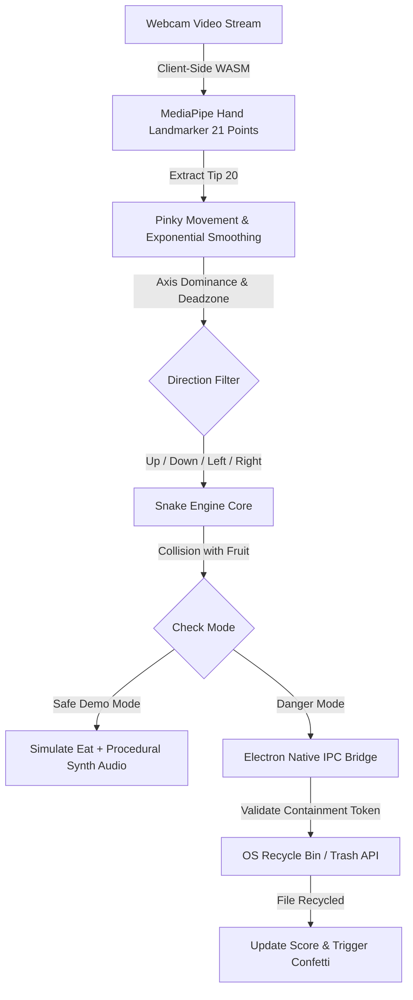

# DangerPinky 🎯

> **The cute snake. The ultimate useless danger.**

## Basic Details
### Team Name: VISHNU K R

### Team Members
- Team Lead: VISHNU K R - SNM INSTITUTE OF MANAGEMENT AND TECHNOLOGY, MALIYANKARA

### Project Description
DangerPinky is an arcade snake game where you steer an innocent-looking, candy-pink snake using only your webcam and your pinky finger. Instead of apples, the snake snacks on real files from your computer folder — and in Danger Mode, every file eaten is thrown straight into your OS Recycle Bin in real time!

### The Problem (that doesn't exist)
Your Downloads and Desktop folders are crammed with 1,429 chaotic files: duplicate memes, blurry screenshots, and 8 copies of `final_assignment_v3_reallyfinal.pdf`. Traditional disk cleanup is boring, tedious, and completely void of adrenaline. You could just drag them to the trash like a civilized human being, but where is the drama? Where is the panic? Where is the glory of losing your resume because your pinky finger had a slight muscle twitch?

### The Solution (that nobody asked for)
We turned file cleanup into an extreme sport called **Russian Roulette for your Filesystem**:
- Put your pinky finger up to your webcam.
- Flick it Up, Down, Left, or Right to steer the hungry candy snake.
- Choose a folder. In **Safe Demo Mode**, enjoy peace of mind with 27 simulated files. In **Danger Mode**, every single bite triggers an OS-level IPC call that moves your actual file straight to the Recycle Bin!
- Have an exam tomorrow? Put your study notes in the folder and pray your webcam tracking doesn't glitch.

---

## Technical Details

### Technologies/Components Used

For Software:
- **Languages used**: TypeScript, JavaScript, HTML5, CSS3
- **Frameworks used**: React 18, Tailwind CSS, Vite
- **Libraries used**: Google MediaPipe Tasks Vision (`@mediapipe/tasks-vision`), Lucide React, Canvas Confetti
- **Tools used**: Electron 34, Node.js IPC, Vitest (39 automated tests), Git, GitHub CLI

For Hardware:
*(N/A - Software Project)*

---

### Implementation

For Software:

# Installation
```bash
# Clone the repository
git clone https://github.com/vishnuu-kr/DangerPinky.git
cd DangerPinky

# Install dependencies
npm install
```

# Run
```bash
# Run Desktop App (with Danger Mode Recycle Bin)
npm run desktop
# or after build:
npm start

# Run in Browser (Safe Demo Web Mode)
npm run dev

# Run Automated Test Suite (39 unit tests)
npm test
```

---

### Project Documentation

For Software:

# Screenshots (Add at least 3)

*DangerPinky Landing Dashboard — choose Safe Demo Mode or High-Stakes Danger Mode*


*Webcam Pinky Tracking in action — snake devouring local files rendered as 3D plump candy fruits*


*Candy Customization Suite — select grid sizes (10x10 standard, 12x12, 16x16), game modes, and sensitivity*


*Game Over modal showing session statistics, files eaten/recycled, and high score fanfare*

# Diagrams

*DangerPinky end-to-end architecture: from webcam computer vision to OS-level file recycling.*

---

For Hardware:

# Schematic & Circuit
*(N/A - Software Project)*

# Build Photos
*(N/A - Software Project)*

---

### Project Demo

# Video
[Add your demo video link here]
*Short demo showing pinky gesture tracking, folder selection, and live file deletion in Danger Mode.*

# Additional Demos
- Built-in offline WebAssembly model support (no external cloud API or uploads required).
- Two-step safety validation token to guarantee only user-selected folders are ever touched.

---

## Team Contributions
- **VISHNU K R**: End-to-end conceptualization, MediaPipe computer vision pinky tracking algorithms, React 18 candy UI redesign, Electron native IPC file system bridge, procedural Web Audio synthesizer, and 39 Vitest automated tests.

---
Made with ❤️ at TinkerHub Useless Projects 


